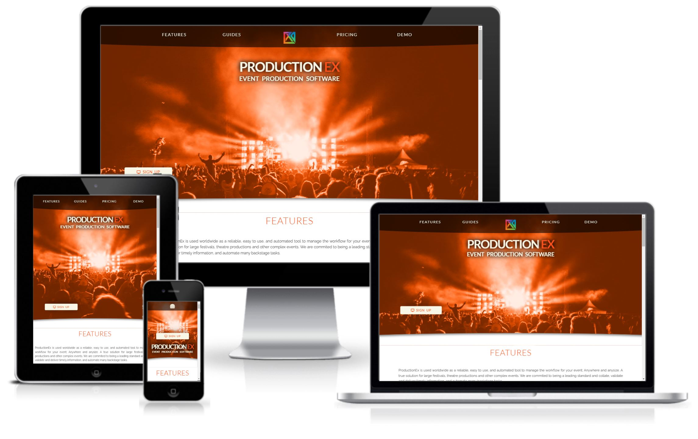
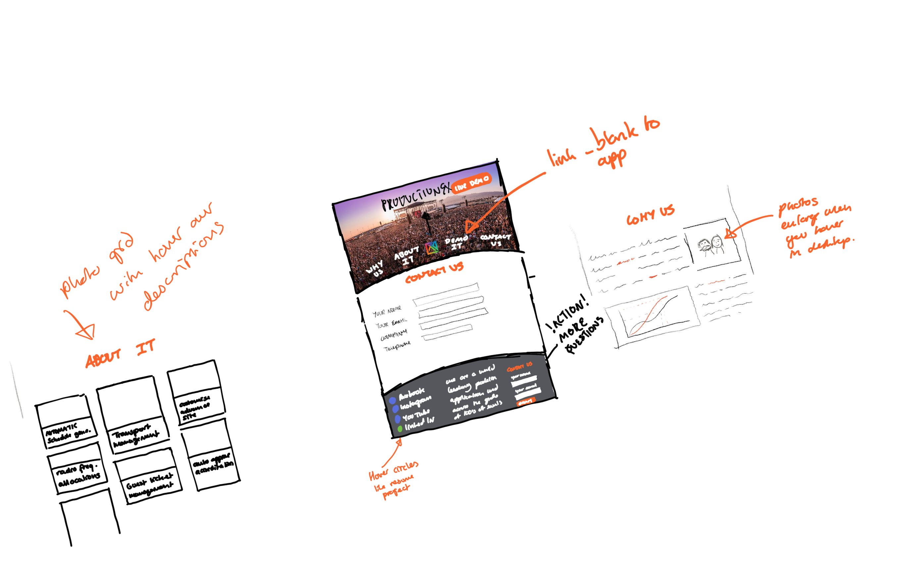

# **ProductionEx**

**View live site** https://tomnaylor.github.io/codeinstitute-ms1/

Welcome to ProductionEx, a production software package for Festivals, Theatres and other complex events. We are a leading standard in managing production information for a range of events, from Glastonbury festival to the stage production of mirror cracked. We collate, validate and deliver timely information, and automate many tasks backstage production tasks.  

For my MS1, I wanted to create a front-end sales website for a web app I designed for a festival my work host bi-annually.

## Table of contents
* [UX](#ux)
    * [User Goals](#user-goals)
    * [User Stories](#user-stories)
    * [Site Owners Goals](#site-owners-goals)
* [Design](#design)
    * [Fonts](#fonts)
    * [Icons](#icons)
    * [Colours](#colours)

## UX

### User Goals
* Sales website to promote theatre/festival production software
* Website should work across mobile/tablet and desktop
* Professional and confident design
* Pages to include use cases/faq/sales/demo
* Call to action for a demo request
* Demo request and contact details should be visible and easy to find
* Provide testimonials and white papers (look up b2b notes)
* Provide comprehensive how-to videos and written guides

### User Stories
As a user…
* I want to hear feedback from current users of the software
* I want to see reviews for current / past users
* I want to find examples of prices for a similar size event
* I want to try a demo before I agree to buy
* I want to view some how-to videos  / guides
* I want to know what software / hardware I may need
* I want to know how resilient the software is and how it works on a green-field festival site
* I want to feel assured that the software will be supported for years to come
* I expect the website to work flawlessly as proof of the software itself

### Site Owners Goals
* Advertise their software to potential theatres / festivals and other events
* Promote the product as the industry standard
* Provide a professional and flawless UX to promote confidance in the software itself.

## Design

### Original sketch
I drew an outline sketch first to get a basic feel of a design. 

### Wireframes
After the initial sketch, I then moved to Balsamic and created a wireframe for the three responsive sizes (desktop, tablet and mobile). You can [view the PDF wireframe here](assets/readme/wireframe-index.pdf)

### Fonts
To provide a reliable and fast font library, I have used [Google Fonts](https://fonts.google.com/ "Google Fonts"), picking two complimentary fonts.

For headings and words I want to stand out I've used the [Lato](https://fonts.google.com/specimen/Lato?preview.text=ProductionEx&preview.text_type=custom "Google fonts: Lato") font. 

For the remaining text I chose the [Raleway](https://fonts.google.com/specimen/Raleway?preview.text=ProductionEx&preview.text_type=custom "Google fonts: Raleway") font.

### Icons
To add a more familiar feel to the website, I have added icons to sit alongside (and sometimes instead of) text links and buttons. I choose the [Font Awesome library](https://fontawesome.com/ "Font Awesome"). 

### Colours

### Hero image
I used the website **unsplash** to find an image that would work as the hero background.

https://unsplash.com/photos/NYrVisodQ2M

## Features
### Existing Features

### Features left to implement

## Technologies used

### Languages
* HTML
* CSS
* Javascript

### Libraries
* Google Fonts (Lato and Raleway)
* FontAwesome (for icons and brand logos)

### Tools
* GitHub
* GitPod
* W3C HTML and CSS validators
* Google Lighthouse
* Balsamic (Wireframe)
* Concepts (Initial drawing)

## Testing

### Discovered Bugs

#### Solved

* **Sign up button**
  * Sign-up button would move below hero image and disapeer behind the main section in mobile devices.
  * To fix the issue I changed the position to use bottom and not top to ensure that whatever the height of the hero image, the CTA stayed 100px from the bottom.

* **Hover client logo**
  * The popup description would open and close quickly as the mouse moved over the client logo container.
  * Changed onmouseover to two seperate calls to mouseenter and mouseleave so the javascript function wasn't trigged on every mouse move.

* **Multiple client logos**
  * The popup description would only open on the first container.
  * With help from [Mamun](https://stackoverflow.com/users/7461381/mamun) in [this post](https://stackoverflow.com/questions/50793136/javascript-click-function-only-works-on-first-element) I altered the javascript to loop thru each matching query.

* **Main nav items**
  * When the screen size reduced to circa. 750px, the top navigation links crashed into each other
  * In the tablet only CSS I removed the centre logo to give the menu items more space

* **Mobile home link**
  * When in mobile view the home logo is removed for space. This was the  link back to the top of the index page. This stopped the user from being able to navigate easily.
  * I added a mobile only home link at the top of the navigation ul list.

* **Videos slowed page loads**
  * Adding the video guides reduced the lighthouse score as each video (x3) preloaded.
  * I added the preload="none" to each video and then to make them visually appealing, I added a poster image to show before playing the media.

* **Sign-up modal**
  * On mobile devices with small height screens the fixed position modal wasn't able to be scrolled. This ment that most of the form inputs were not accessable
  * Changed the height to 100% and removed the bottom and right css entries to allow the box to expand to show all the contents.

* **Transitions**
  * All transitions happened on page load (which started from the non styled state)
  * This seems to be a bug with the chrome browser. I used advice on [this page](https://github.com/LeaVerou/prefixfree/issues/99) and added an empty script tag at the bottom of the body. This seems to have stopped the issue for me.

